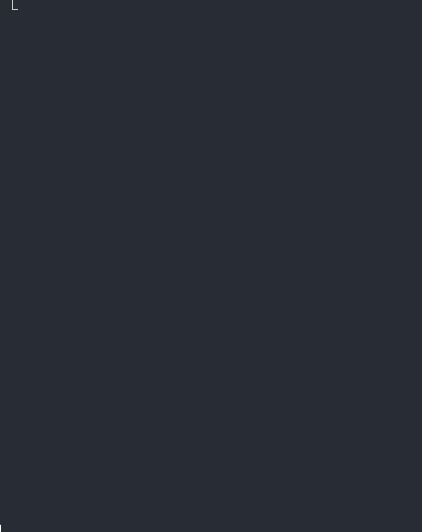

<h1 align="center">
  Rotten
  <br>
  <a href="https://github.com/robalyx/rotten/blob/main/LICENSE">
    
  </a>
  <a href="https://github.com/robalyx/rotten/actions/workflows/ci.yml">
    
  </a>
  <a href="https://github.com/robalyx/rotten/issues">
    
  </a>
  <a href="CODE_OF_CONDUCT.md">
    
  </a>
  <a href="https://discord.gg/2Cn7kXqqhY">
    
  </a>
</h1>

<p align="center">
  <em>A simple tool that lets you check Roblox accounts against <a href="https://github.com/robalyx/rotector">Rotector</a> exports.</em>
</p>

> [!WARNING]
> This tool is currently experimental. The official exports available are from short test runs and contain a limited number of IDs. A proper release with better exports will be made when the tool is ready.

## 📚 Table of Contents

- [🎥 Demo](#-demo)
- [📦 Export Types](#-export-types)
- [🔒 Hash Types](#-hash-types)
- [📖 Usage Guide](#-usage-guide)
- [🔄 Adding Exports](#-adding-exports)
- [❓ FAQ](#-faq)
- [👥 Contributing](#-contributing)
- [📄 License](#-license)

## 🎥 Demo

<p align="center">
  
</p>

Rotten provides a **simple terminal interface** to check if Roblox accounts are flagged as inappropriate. You can check **individual users**, **groups**, or scan **entire friend lists** to avoid association with flagged accounts.

The tool uses exports generated by [Rotector](https://github.com/robalyx/rotector), a powerful system that identifies and stores a list of inappropriate Roblox accounts to a database. By default, the official exports from the Rotector team are provided but you may also [import your own](#-export-types).

After entering a Roblox ID, you'll see if the account is flagged, along with the status and reason if found. For friend checks, you'll get a summary showing how many friends are flagged, helping you clean up your friend list.

> [!TIP]
> Regularly check your friend list to ensure you're not connected to flagged accounts!

## 📦 Export Types

> [!NOTE]
> If you're not a developer, don't worry about these formats! Just choose SQLite in the tool as it's the recommended option for everyone. The other formats work fine too - they just store the data differently.

[Rotector](https://github.com/robalyx/rotector) extracts data in **three different storage formats**, each designed for different use cases. Rotten supports reading all three formats.

- **SQLite** format is ideal for production environments where it stores data in a database file to allow for fast lookups on large amounts of data.

- **Binary** format offers a more compact solution, storing data in a custom binary format. It's good for basic lookups while minimizing disk space.

- **CSV** format is for those who prefer simplicity and human-readable data. Everything is stored in plain text files that can be opened in a file editor or spreadsheet application.

You can find the implementation details in our source code if you need to understand how the files are read: [sqlite.go](internal/checker/sqlite/sqlite.go) for SQLite, [binary.go](internal/checker/binary/binary.go) for Binary format, and [csv.go](internal/checker/csv/csv.go) for CSV handling.

## 🔒 Hash Types

> [!NOTE]
> These hash types don't affect how you use the tool - they just determine how secure the exports are. However, if you're using exports that use Argon2id (like the official ones), the checks will be much slower compared to SHA256.

To protect user privacy, Rotector's exports **never contain raw Roblox IDs**. Instead, it uses secure hashing algorithms to transform these IDs into unrecognizable hashes.

- The default method is **Argon2id**, a memory-hard hashing algorithm that makes it extremely difficult to reverse-engineer the original IDs - it would take months even with powerful hardware. The official exports always use Argon2id to ensure maximum security.

- While we also support **SHA256** for testing and development, it's not recommended as it's more vulnerable to reverse lookup attacks since it doesn't take long to crack all hashes.

## 📖 Usage Guide

1. **Download the Executable**:
   - Visit the [latest release page](https://github.com/robalyx/rotten/releases/latest)
   - Download the appropriate executable for your platform:
     - `rotten-linux-amd64` for Linux
     - `rotten-windows-amd64.exe` for Windows
     - `rotten-darwin-amd64` for macOS (Intel)
     - `rotten-darwin-arm64` for macOS (Apple Silicon)

2. **Run the Executable**:
   ```bash
   # Linux
   ./rotten-linux-amd64
   # Windows
   .\rotten-windows-amd64.exe
   # macOS (Intel)
   ./rotten-darwin-amd64
   # macOS (Apple Silicon)
   ./rotten-darwin-arm64
   ```

3. **Select Check Type**:
   - Use arrow keys to choose between:
     - User: Check user IDs
     - Group: Check group IDs
     - Friends: Scan entire friend lists

4. **Choose Export Source**:
   - Select "Download Official Export" to get the latest compatible export
   - Or choose from existing exports in the current directory where you run the executable

5. **Select Storage Type** (after export is downloaded/selected):
   - Choose between SQLite, Binary, or CSV
   - SQLite is the recommended option

6. **Enter ID**:
   - Type the Roblox ID to check
   - For friend checks, this will scan their entire friend list

7. **View Results**:
   - View status and reason if flagged
   - For friends check, see total flagged friends and scroll through results

> [!TIP]
> When you first run the program, select "Download Official Export" to download an export that works with your version. We recommend you choose the latest version.

## 🔄 Adding Exports

> [!NOTE]
> This section is for developers who run Rotector themselves and want to export their data. If you're just a regular user using the official exports, you can skip this section.

To export your Rotector data from PostgreSQL, follow these steps:

1. Run the exporter tool from the [Rotector repository](https://github.com/robalyx/rotector) using either:
   ```bash
   ./exporter
   # or if running from source
   go run ./cmd/export
   ```

2. Follow the interactive prompts to configure your export:
   - Set the salt value to use for hashing (can be anything)
   - Set the export description and version
   - Choose hash type (Argon2id recommended)
   - Set hash configuration (memory, iterations)

3. Wait for the export to complete. You'll find a new directory in the `exports` folder containing:
   - `export_config.json` - Contains hash settings and export metadata
   - Storage files for each format:
     - SQLite: `users.db`, `groups.db`
     - Binary: `users.bin`, `groups.bin`
     - CSV: `users.csv`, `groups.csv`

4. Move this directory to where the Rotten executable is located

5. Restart Rotten - your export will appear in the directory selection menu

> [!TIP]
> The `export_config.json` is crucial - it tells Rotten what hash type and configuration was used. Make sure this file is present in your export directory!

## ❓ FAQ

<details>
<summary>What is Rotector?</summary>

[Rotector](https://github.com/robalyx/rotector) is an advanced system that uses AI and smart algorithms to detect inappropriate Roblox accounts. If you're familiar with **Mod For Dummies**, who manually identify inappropriate accounts, Rotector is essentially a more powerful automated version that can process **hundreds of thousands of users per hour**. The list of flagged accounts can be exported in different formats which can then be used by tools like Rotten to help keep the platform safer.

</details>

<details>
<summary>Why do exports use hashed IDs instead of raw IDs?</summary>

The exports use **hashed IDs** instead of raw Roblox IDs to prevent potential abuse. If raw IDs were included, malicious users could use these exports to locate other inappropriate accounts. When you provide a user ID to check in Rotten, it's first converted to a hash using the same method as the export, which is then compared against the list to determine if it's a match.

</details>

<details>
<summary>Can I use Rotector exports in my own project?</summary>

**Absolutely!** We actively encourage developers to use the official exports for building tools and integrations that help make the Roblox community safer. Rotten itself is an example of such a tool, officially developed by the Rotector team to demonstrate how these exports can be used effectively.

</details>

<details>
<summary>How are exports structured and read?</summary>

Each export directory contains an **export_config.json** file that specifies the hash type and configuration used for that export. Developers building tools can reference this file to properly configure their SHA256 or Argon2id hash parameters. The remaining files are storage files that contain the actual data in different formats. For more details on the available storage formats, check out the [Export Types](#-export-types) section.

</details>

<details>
<summary>Should I use Argon2id or SHA256 when creating exports?</summary>

If you're exporting from your own Rotector database, use **Argon2id** when you want to ensure maximum security of the IDs in your export. With Argon2id, it would take months even with powerful hardware to crack the hashes. However, if you need a simpler form of obfuscation that's faster to process, **SHA256** can be used - just be aware that it's more vulnerable to being cracked quickly.

</details>

<details>
<summary>Why is the friends check so slow?</summary>

The friends check can be slow for a couple of reasons. First, if the user has a **large number of friends**, the tool needs to check each friend's ID individually against the export, which naturally takes more time with more friends to process.

Another significant factor is the **hash type used in your export**. If you're using an export that uses Argon2id hashing (like the official exports), the checks will be much slower compared to SHA256. This is because Argon2id is intentionally designed to be computationally intensive to provide better security. You can learn more about why this matters in the [Hash Types](#-hash-types) section.

</details>

<details>
<summary>How can I integrate exports in other programming languages?</summary>

While we don't provide official support for other languages, you can easily use AI tools to translate our Go implementations into your preferred language. The source code for each storage type can be found in [sqlite.go](internal/checker/sqlite/sqlite.go) for SQLite, [binary.go](internal/checker/binary/binary.go) for Binary format, and [csv.go](internal/checker/csv/csv.go) for CSV handling. These files contain all the logic needed to read and process the exports.

</details>

<details>
<summary>How do I know if the official export is up to date?</summary>

The program automatically manages export compatibility for you. When you select **"Download Official Export"**, it will display a list of exports that are compatible with your current version of the tool. If you see a message indicating that you need to update the tool, this means there's a newer version available with important engine improvements. In this case, you should download the latest version of Rotten from the [releases](https://github.com/robalyx/rotten/releases) page, as older versions will no longer receive official support.

</details>

## 👥 Contributing

We follow the [Contributor Covenant](CODE_OF_CONDUCT.md) Code of Conduct. If you're interested in contributing to this project, please abide by its terms.

## 📄 License

This project is licensed under the GNU General Public License v2.0 - see the [LICENSE](LICENSE) file for details.

---

<p align="center">
  Made with ❤️ by the robalyx team
</p>
